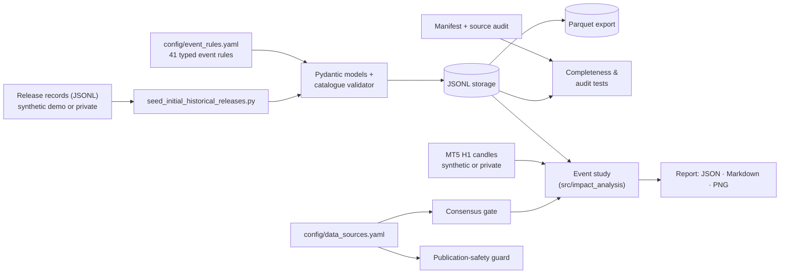

# EUR/USD Macroeconomic Event Catalogue

**Provenance, normalization, validation and event-study pipeline**

A typed, validated catalogue of the high-impact macroeconomic releases that
matter for EUR/USD, with explicit timestamp provenance, a structured source
audit, a data-rights policy that is enforced in code, and a reproducible
single-event study that aligns a release with EUR/USD H1 candles.

> **Status: research prototype.** The historical work covers a **January 2024
> research slice**, not a multi-year dataset. Most of that slice is kept
> private because it mixes sources with different redistribution rights; the
> public repository ships the pipeline, the rules, the audit methodology,
> synthetic demonstration data and one reviewed official record.
> (`eurusd_news_analysis` is the project's historical working name.)

## Problem statement

Measuring how EUR/USD reacts to macroeconomic news needs more than a list of
dates. You need to know **which** publications matter and why, the **exact
instant** each one became public (in the publisher's time zone, in UTC and in
the broker-server clock that labels the price candles), **where every number
came from**, and whether you are even **allowed to republish** it. Commercial
economic calendars hide most of these decisions.

This project makes them explicit:

- rule-based selection of EUR- and USD-relevant events (core vs. conditional);
- one validated record per publication, with components, units and three
  consistent timestamps;
- a completeness manifest and a field-by-field source audit;
- a source registry that decides what can be published, and a guard that
  checks every public commit candidate against it;
- an event study whose timing assumptions are stated, tested and reported.

## Current scope

| Area | State (verified) |
|---|---|
| Event rules | 41 rules for EUR and USD: 10 very-high, 21 core-high, 10 conditional-high (`config/event_rules.yaml`) |
| January 2024 manifest | 36 expected publications: 34 core + 2 activated conditional, incl. a 6-member German state-CPI group |
| Research catalogue | 47 stored releases (all 36 January publications + 11 early-February ones) — **private, not distributed** |
| Formal source audit | 5 of 36 January records audited: 4 verified, 1 partially verified |
| Public data | 5 synthetic releases, synthetic H1 candles, 1 reviewed BLS record (`data/demo/`) |
| Event study | 1 event (U.S. CPI, 11 Jan 2024 13:30 UTC). Public demo uses **synthetic prices**; the same pipeline was also run locally on authentic MT5 prices (private output) |
| Consensus / forecasts | Not available (no rights-cleared source) |
| Collectors | None — data was transcribed manually; `src/collectors/` is intentionally empty |

## Architecture



## Main capabilities

- **Typed domain models** (Pydantic v2, strict): unknown fields rejected;
  timestamps must be timezone-aware and the official, UTC and MT5 times must
  denote the same instant; numeric vs. text components with unit rules;
  explicit `data_origin` (`authentic` / `synthetic`) with a mandatory
  `synthetic_` ID prefix for synthetic records.
- **Event-rule catalogue** with core/conditional activation rules, release
  families and a de-duplication policy.
- **Catalogue validation**: every release must reference a known event rule
  and known component keys; German state-CPI publications must carry group and
  geography metadata and exactly the approved components.
- **Persistence**: append-only JSONL with duplicate protection, idempotent
  data-file-driven seeding (refuses to mix synthetic and authentic records),
  flattened one-row-per-component Parquet export.
- **Completeness and audit**: January 2024 manifest tests; a structured source
  audit (identity, source, timestamps, values, units, notes) with a documented
  public redaction.
- **Data governance**: machine-readable source registry and a
  publication-safety guard that simulates `git add .` and rejects private
  data, restricted-source values, undeclared provenance, credential-like
  strings and personal paths.
- **Event study**: MT5 export loading and validation, event-to-H1 alignment
  with an explicit server offset, DST-crossing guard, tick-volume diagnostic
  for the server offset, window returns and volatility, strict missing-candle
  handling, consensus-surprise gate.
- **Reporting**: deterministic JSON, Markdown and PNG outputs whose file names
  and headers state the price-data origin.
- **Tests**: 151 automated tests (see [Tests](#tests)).

## Repository structure

```text
config/
  event_rules.yaml                 41 EUR/USD event rules
  data_sources.yaml                source registry: redistribution status per publisher
  project_settings.yaml
  historical_release_audits/
    january_2024.yaml              expected-publication manifest (36 releases)
    january_2024_source_audit.yaml source audit (public, redacted)
data/
  demo/                            public demo data + demo_manifest.yaml
  raw/ processed/ reports/         local working folders (git-ignored contents)
docs/
  event_study_methodology.md       full methodology
  example_output/                  report generated from the public demo
scripts/
  seed_initial_historical_releases.py   JSONL records -> validated catalogue
  export_historical_releases_parquet.py catalogue -> Parquet
  generate_eurusd_report.py             event-study report CLI
  generate_synthetic_demo_data.py       regenerate/check synthetic fixtures
  check_publication_safety.py           publication-safety guard
  inspect_event_catalogue.py            catalogue summary
src/
  economic_calendar/   models, rule catalogue, validation, storage, Parquet, seeding, timestamps
  data_governance/     source registry and publication guard
  impact_analysis/     price loading, event study, consensus gate
  reporting/           JSON / Markdown / PNG report writer
  demo_data/           deterministic synthetic fixtures
  collectors/          intentionally not implemented (see docstring)
tests/                 pytest suite
DATA_SOURCES.md        data-rights policy and per-source treatment
LICENSE                MIT (code only)
```

## Quick start

Python 3.11 or newer is required. The project was developed and tested with Python 3.12.

### Windows PowerShell

```powershell
git clone https://github.com/Yevguen/eurusd_news_analysis.git
cd eurusd_news_analysis

py -3.12 -m venv .venv
.\.venv\Scripts\Activate.ps1

python -m pip install -r requirements.txt
python -m pytest
```

### macOS / Linux

```bash
python3 -m venv .venv
source .venv/bin/activate
python -m pip install -r requirements.txt
python -m pytest
```

## Demo

All commands run from the repository root and use only public data.

```powershell
# 1. Summarise the event-rule catalogue
python scripts/inspect_event_catalogue.py

# 2. Seed the SYNTHETIC demo catalogue (writes data/processed/demo/, git-ignored)
python scripts/seed_initial_historical_releases.py

# 3. Export it to Parquet
python scripts/export_historical_releases_parquet.py `
    --input data/processed/demo/synthetic_releases.jsonl `
    --output data/processed/demo/release_components.parquet

# 4. Event study: BLS CPI release (authentic) + SYNTHETIC EUR/USD candles
python scripts/generate_eurusd_report.py --demo

# 5. Check what a public commit would contain
python scripts/check_publication_safety.py
```

To analyse your own MetaTrader 5 export (kept private):

```powershell
python scripts/generate_eurusd_report.py `
    --releases data/demo/official_releases_allowlist.jsonl `
    --release-id us_cpi_2024_01_11 `
    --prices <path-to-EURUSD_H1-MT5-export.csv> `
    --price-data-origin authentic_private
```

Reports from `authentic_private` prices can only be written under the
git-ignored `data/reports/` or outside the repository. Missing inputs, an
unknown `release_id`, a missing `--price-data-origin`, relabelling the
synthetic demo file, gaps in the candle window or a window that crosses a
daylight-saving change all stop the run with a clear error (exit code 2).

## Example output

Generated by `python scripts/generate_eurusd_report.py --demo`
([Markdown report](docs/example_output/us_cpi_2024_01_11__synthetic_prices.md),
[JSON](docs/example_output/us_cpi_2024_01_11__synthetic_prices.json)).


> **The prices in this example are synthetic** — invented noise that starts at
> 1.00000 and contains no event effect. The chart demonstrates the pipeline
> (alignment of a 13:30 UTC release inside the 13:00 candle, windows, metrics,
> labelling); it says nothing about how EUR/USD actually moved. The event
> record itself is authentic (U.S. Bureau of Labor Statistics).

Excerpt of the generated metrics:

| Metric | Value (synthetic prices) |
|---|---:|
| Minutes between event-candle open and release | 30 |
| Event-candle return, ln(C0/C-1) | +3.89 bp |
| Baseline volatility (24 h, std of hourly returns) | 6.50 bp |
| Event move in baseline sigmas | 0.60 |
| Server-offset tick-volume diagnostic | inconclusive |
| Consensus surprise | unavailable (no rights-cleared source) |

## Tests

```powershell
python -m pytest
```

Current result on a public checkout (no private data present):
**151 tests — 148 passed, 3 skipped.** The three skipped tests check the
private January 2024 catalogue against the manifest; they run automatically
when that catalogue is present locally and are skipped with an explicit reason
otherwise. With the private catalogue present, all 151 pass.

The suite covers models and timestamps, the rule catalogue, catalogue
validation, JSONL storage and seeding, Parquet export, the manifest and source
audit, the source registry, the publication guard (including a simulated
`git add .` against the real `.gitignore`), MT5 loading, alignment, returns,
volatility, missing-candle handling, DST guard, offset diagnostic, consensus
gate, report determinism and the CLI's failure modes.

## Data provenance

Every record and file declares its origin, and every URL maps to a registered
source with a redistribution status. Official sources whose terms were
reviewed (BLS, BEA, Census, Federal Reserve Board, Eurostat, ECB, Destatis)
may appear in reviewed public fixtures with attribution; proprietary or
unreviewed sources (S&P Global PMI, ISM, ZEW, ifo, University of Michigan,
ADP, PR Newswire, German state statistical offices, broker price data) are
represented by metadata only. Details, terms links and attribution text:
**[DATA_SOURCES.md](DATA_SOURCES.md)**. The classifications are conservative
engineering decisions, not legal advice.

## Data not included

- The full January 2024 research catalogue (47 releases), its Parquet exports
  and the unredacted source audit — they combine values from restricted,
  unresolved and reusable sources.
- Any EUR/USD price history from a broker (MetaTrader 5 exports).
- Reports generated from private prices.
- Consensus/forecast values from commercial vendors (never collected).

## Limitations

- **Scope:** one month (January 2024) of publications; not a multi-year dataset.
- **Audit coverage:** only 5 of the 36 January records have formal audit
  entries (4 verified, 1 partially verified: the exact 10:00 CET time of the
  Bavarian state-CPI release is unconfirmed).
- **No consensus data:** conventional actual-minus-consensus surprise analysis
  is not possible yet; the gate reports it as unavailable.
- **Provisional MT5 offset:** candles are converted with the catalogue's
  provisional `+02:00` winter offset. On one event, a local run on authentic
  broker data showed a tick-volume jump consistent with `+02:00`; this is
  circumstantial evidence, not verification.
- **Event-study coverage:** a single, descriptive event study at H1 resolution.
  Releases at hh:30 share their event candle with 30 minutes of pre-release
  trading; no cross-event statistics, no control for concurrent news.
- **Synthetic public fixtures:** the public demo's prices and five of its six
  release records are synthetic.
- **Provenance fields:** records do not yet store a per-record retrieval date.

## Roadmap

Completed:

- [x] Typed models, rule catalogue, validation, JSONL and Parquet persistence
- [x] January 2024 manifest, completeness tests and source-audit methodology
- [x] Data-source registry, publication guard, synthetic demo data
- [x] Single-event H1 event study with report generation

Future work (not implemented):

- [ ] Broader release coverage beyond January 2024 and more formal audits
- [ ] Review and publish more official-source records via the allowlist
- [ ] Forecast/consensus integration from a legally reusable source
- [ ] Multi-event statistics (averages, dispersion, significance) and
      multi-window impact metrics
- [ ] Per-record retrieval dates; verification of the MT5 server-time rule
- [ ] Richer visualisation

## Licensing

- **Code:** [MIT](LICENSE).
- **Third-party dependencies:** their own open-source licences.
- **Data:** the MIT licence does **not** cover third-party data. Each source
  remains subject to its publisher's terms — see [DATA_SOURCES.md](DATA_SOURCES.md).
  The synthetic demonstration data is generated by this project.

Not investment advice.
