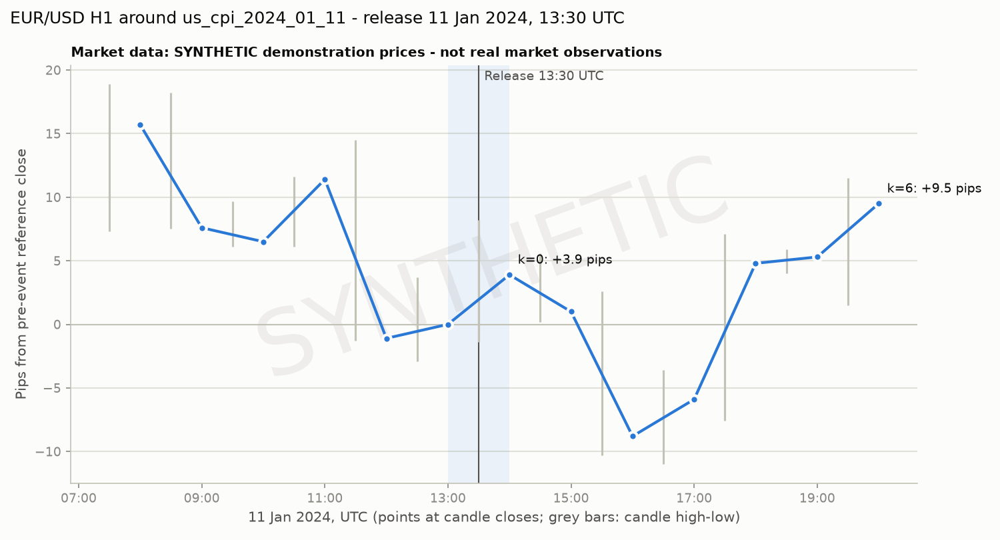

# EUR/USD H1 event study - `us_cpi_2024_01_11`

> **DATA ORIGIN**
> - Event record: **AUTHENTIC** (U.S. Bureau of Labor Statistics)
> - Market data: **SYNTHETIC demonstration prices - not real market observations**
> - Price source: SYNTHETIC_eurusd_h1_mt5_format.csv (MT5 H1 export layout)

> The price series is synthetic noise with no injected event effect. The numbers below demonstrate the pipeline only and must not be read as EUR/USD market behaviour.

## Event

| Field | Value |
|---|---|
| Release ID | `us_cpi_2024_01_11` |
| Event rule | `us_cpi` |
| Reference period | 2023-12 |
| Official source | [U.S. Bureau of Labor Statistics](https://www.bls.gov/news.release/archives/cpi_01112024.htm) |
| Official release time | 2024-01-11T08:30:00-05:00 |
| UTC release time | 2024-01-11T13:30:00+00:00 |
| MT5 server time (provisional) | 2024-01-11T15:30:00+02:00 |

| Component | Actual | Previous | Forecast | Unit |
|---|---:|---:|---:|---|
| Headline CPI (MoM) | 0.3 | 0.1 | n/a | percent month-over-month |
| Headline CPI (YoY) | 3.4 | 3.1 | n/a | percent year-over-year |
| Core CPI (MoM) | 0.3 | 0.3 | n/a | percent month-over-month |
| Core CPI (YoY) | 3.9 | 4.0 | n/a | percent year-over-year |

## Timestamp provenance and candle alignment

- The event instant is the official release time converted to UTC: **2024-01-11 13:30 UTC**.
- MT5 candles are labelled in broker-server time; the study converts them with a fixed offset of **UTC+2** taken from the release record's provisional `mt5_server_time` (not a verified broker fact).
- Event candle (k = 0): opens 2024-01-11 13:00 UTC = 2024-01-11 15:00 server time.
- The release occurred **30 minutes** after the event candle opened; the event candle therefore mixes pre- and post-release trading.
- Windows: anchor k = -31; baseline k = -30..-7 (24 candles); pre-event k = -6..-1; event k = 0; post-event k = 1..6.

## Results

| Metric | Value |
|---|---:|
| Reference close C(-1) | 1.00354 |
| Event-candle return, ln(C0/C-1) | +3.89 bp |
| Event-candle range (high-low) | 9.6 pips |
| Baseline volatility (std of hourly returns) | 6.50 bp |
| Event move in baseline sigmas, abs(r0)/sigma | 0.60 |
| Event range / mean baseline range | 0.96 |
| Event tick volume / baseline median | 0.90 |
| Pre-event drift (k = -6..-1) | -8.27 bp |
| Pre-event realised volatility | 7.60 bp |
| Post-event realised volatility | 6.91 bp |
| Cumulative to close of k = 0 | +3.89 bp (+3.9 pips) |
| Cumulative to close of k = 1 | +1.00 bp (+1.0 pips) |
| Cumulative to close of k = 3 | -5.88 bp (-5.9 pips) |
| Cumulative to close of k = 6 | +9.46 bp (+9.5 pips) |

### Candles

| k | Open (UTC) | Open (server) | Open | High | Low | Close | Tick vol | Return bp | Cum. bp | Pips |
|---:|---|---|---:|---:|---:|---:|---:|---:|---:|---:|
| -6 | 2024-01-11 07:00 | 2024-01-11 09:00 | 1.00437 | 1.00543 | 1.00427 | 1.00511 | 1146 | +7.37 | +15.63 | +15.7 |
| -5 | 2024-01-11 08:00 | 2024-01-11 10:00 | 1.00511 | 1.00536 | 1.00429 | 1.00430 | 1145 | -8.06 | +7.57 | +7.6 |
| -4 | 2024-01-11 09:00 | 2024-01-11 11:00 | 1.00430 | 1.00451 | 1.00415 | 1.00419 | 922 | -1.10 | +6.47 | +6.5 |
| -3 | 2024-01-11 10:00 | 2024-01-11 12:00 | 1.00419 | 1.00470 | 1.00415 | 1.00468 | 818 | +4.88 | +11.35 | +11.4 |
| -2 | 2024-01-11 11:00 | 2024-01-11 13:00 | 1.00468 | 1.00499 | 1.00341 | 1.00343 | 1065 | -12.45 | -1.10 | -1.1 |
| -1 | 2024-01-11 12:00 | 2024-01-11 14:00 | 1.00343 | 1.00391 | 1.00325 | 1.00354 | 827 | +1.10 | +0.00 | +0.0 |
| 0 | 2024-01-11 13:00 | 2024-01-11 15:00 | 1.00354 | 1.00436 | 1.00340 | 1.00393 | 920 | +3.89 | +3.89 | +3.9 |
| 1 | 2024-01-11 14:00 | 2024-01-11 16:00 | 1.00393 | 1.00410 | 1.00356 | 1.00364 | 870 | -2.89 | +1.00 | +1.0 |
| 2 | 2024-01-11 15:00 | 2024-01-11 17:00 | 1.00364 | 1.00380 | 1.00251 | 1.00266 | 1121 | -9.77 | -8.77 | -8.8 |
| 3 | 2024-01-11 16:00 | 2024-01-11 18:00 | 1.00266 | 1.00318 | 1.00244 | 1.00295 | 1016 | +2.89 | -5.88 | -5.9 |
| 4 | 2024-01-11 17:00 | 2024-01-11 19:00 | 1.00295 | 1.00425 | 1.00278 | 1.00402 | 809 | +10.66 | +4.78 | +4.8 |
| 5 | 2024-01-11 18:00 | 2024-01-11 20:00 | 1.00402 | 1.00413 | 1.00394 | 1.00407 | 1190 | +0.50 | +5.28 | +5.3 |
| 6 | 2024-01-11 19:00 | 2024-01-11 21:00 | 1.00407 | 1.00469 | 1.00369 | 1.00449 | 854 | +4.18 | +9.46 | +9.5 |

Baseline candles (k = -30..-7) are included in the JSON output.

## MT5 server-offset diagnostic (tick volume)

| Candidate offset | Candidate event candle (server) | Tick volume | Previous candle | Jump ratio |
|---|---|---:|---:|---:|
| UTC+0 | 2024-01-11 13:00 | 1065 | 818 | 1.30 |
| UTC+1 | 2024-01-11 14:00 | 827 | 1065 | 0.78 |
| UTC+2 | 2024-01-11 15:00 | 920 | 827 | 1.11 |
| UTC+3 | 2024-01-11 16:00 | 870 | 920 | 0.95 |

Verdict: **inconclusive**. No candidate offset shows a clearly dominant tick-volume jump (best ratio 1.30x). The offset remains an assumption.

## Consensus surprise

Unavailable: no forecast/consensus values are recorded for this release, and no rights-cleared consensus source is available to the project.

## Methodology

- Candle return: r_k = 10,000 x ln(C_k / C_(k-1)) basis points.
- Reference price: C_(-1), the close of the last complete candle before the event candle.
- Cumulative return to k: 10,000 x ln(C_k / C_(-1)); pips: (C_k - C_(-1)) x 10,000.
- Baseline volatility: sample standard deviation (ddof = 1) of r_k over the baseline window.
- Missing candles inside any window stop the study; nothing is filled or interpolated.
- Full definitions: `docs/event_study_methodology.md`.

## Limitations

- Market data is SYNTHETIC. Every price-based number in this report is a pipeline demonstration and says nothing about how EUR/USD actually reacted.
- The MT5 server offset UTC+2 is the catalogue's provisional assumption, not a verified broker fact; tick-volume diagnostic verdict: inconclusive.
- The release occurred 30 minutes after the event candle opened, so the event-candle return also contains pre-release trading. H1 data cannot isolate the first minutes after the release.
- Consensus-surprise analysis unavailable: no forecast/consensus values are recorded for this release, and no rights-cleared consensus source is available to the project.
- Single-event, descriptive study: no control for concurrent news, no cross-event statistics and no causal claim.

Source: U.S. Bureau of Labor Statistics. Values are transcribed and restructured by this project.

---

Generated by `scripts/generate_eurusd_report.py`. Code: MIT licence. Third-party data remains subject to its own terms (see `DATA_SOURCES.md`). Not investment advice.
